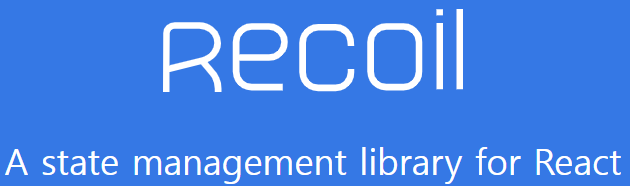

# **Overview**



리코일은 리액트에서 직접만든 상태관리 기술로

> **리액트를 위한 상태관리 라이브러리**

라는 표현와 함께 출시되었다.  

리액트의 기본기술들과 조화가 잘맞고  
생김새도 매우유사한 기술이다.

***

## 장점
  
1. 사용하기가 상태관리기술중 가장 쉽다.

* 리액트에서 기본제공하는 Hooks API와 매우 유사한 모습과
전역이라는 점을 제외하면 거의 동일한 사용방식을 가지고있다.

2. 리액트의 컴포넌트 구조에 잘 어울린다.

* 리액트처럼 행동하기 때문에 어떻게 동작할지 쉽게 예상할 수 있으며 따로 외부스토어를 구성할 없이 컴포넌트가 사용하는 
데이터들로만 상태를 만들고 관리할 수 있다.

3. 비동기흐름을 제어하는 내장솔루션을 가지고 있다. 

* API를 다루는등 비동기에 필요한 함수들을 따로 구현할 필요없이 내장하고 있다

## 단점

1. 정보가 많이 없다.
* 한글로된 친절한 예제 코드조각 보다는 공식사이트 레퍼런스에서 정보를 습득하게 된다.

2. devtools이 따로 없다
* 디버깅 하기위해 recoil에서 만들어진 함수들을 사용해야한다.

3. 캐시컨트롤이 쉽지않다
* 리코일은 API등 비동기로 가져온 값에 대해 자동으로 캐싱이 되는데 이것을 강제로 새로고침하는 함수가 지금은 없다.

***

# **Tutorial**

공식사이트의 튜토리얼인  
TodoList를 만들면서 recoil을 배워보자.


## **Atom**

atom은 react의 useState처럼  
상태관리기능과 함께 전역으로 상태를 가진다.

```javascript
const todoListState = atom({
  key: 'todoListState',
  default: [],
});
```
key는 고유한 이름이 되고
default는 생성될때의 기본값이 된다.


### TodoList - 틀만들기
```javascript
function TodoList() {
  const todoList = useRecoilValue(todoListState);

  return (
    <>
      {/* <TodoListStats /> */}
      {/* <TodoListFilters /> */}
      <TodoItemCreator />

      {todoList.map((todoItem) => (
        <TodoItem key={todoItem.id} item={todoItem} />
      ))}
    </>
  );
}
```
이 컴포넌트를 완성해 가며 리코일을 학습한다.

### TodoItemCreator - Item을 생성하는 컴포넌트

```javascript
function TodoItemCreator() {
  const [inputValue, setInputValue] = useState('');
  
  //이런식으로 다른 컴포넌트에서 받을 수 있다.
  const setTodoList = useSetRecoilState(todoListState);

  const addItem = () => {
    setTodoList((oldTodoList) => [
      ...oldTodoList,
      {
        id: getId(),
        text: inputValue,
        isComplete: false,
      },
    ]);
    setInputValue('');
  };

  const onChange = ({target: {value}}) => {
    setInputValue(value);
  };

  return (
    <div>
      <input type="text" value={inputValue} onChange={onChange} />
      <button onClick={addItem}>Add</button>
    </div>
  );
}

// 고유한 Id 생성을 위한 유틸리티
let id = 0;
function getId() {
  return id++;
}
```
주요부분 주석으로 표시

### TodoItem - Item의 동작과 구현
```javascript
function TodoItem({item}) {
  //이런식으로 다른 컴포넌트에서 받을 수 있다.
  const [todoList, setTodoList] = useRecoilState(todoListState);
  const index = todoList.findIndex((listItem) => listItem === item);

  //TodoItem의 텍스트 수정
  const editItemText = ({target: {value}}) => {
    const newList = replaceItemAtIndex(todoList, index, {
      ...item,
      text: value,
    });

    setTodoList(newList);
  };

  //TodoItem의 완료여부 체크
  const toggleItemCompletion = () => {
    const newList = replaceItemAtIndex(todoList, index, {
      ...item,
      isComplete: !item.isComplete,
    });

    setTodoList(newList);
  };
  
  //TodoItem 삭제
  const deleteItem = () => {
    const newList = removeItemAtIndex(todoList, index);

    setTodoList(newList);
  };

  return (
    <div>
      <input type="text" value={item.text} onChange={editItemText} />
      <input
        type="checkbox"
        checked={item.isComplete}
        onChange={toggleItemCompletion}
      />
      <button onClick={deleteItem}>X</button>
    </div>
  );
}

function replaceItemAtIndex(arr, index, newValue) {
  return [...arr.slice(0, index), newValue, ...arr.slice(index + 1)];
}

function removeItemAtIndex(arr, index) {
  return [...arr.slice(0, index), ...arr.slice(index + 1)];
}
```
주요부분 주석으로 표시

***

## **Selector**
selector는 상태에서 파생된 데이터로 다른 atom에 의존하는 동적인 데이터를 만들 수 있게 해준다.